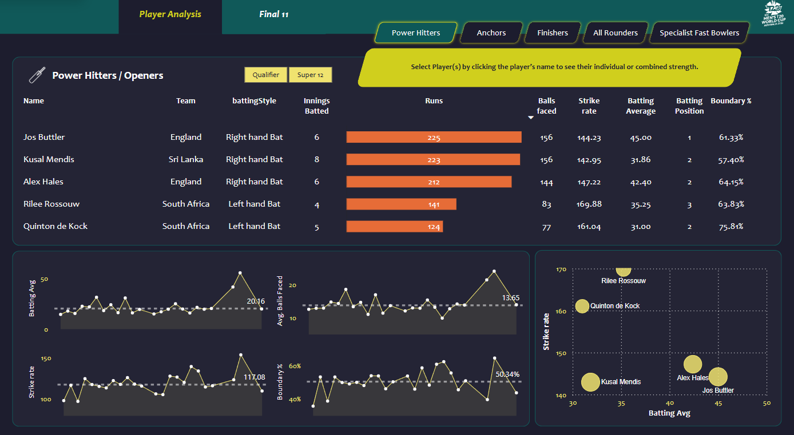

# Project Title

*Cricket Data Insights*

# Overview

This project involves a comprehensive analysis of cricket data, utilizing statistical techniques and advanced data visualization tools. The analysis covers various aspects of the game, including player performance, match outcomes, and team strategies. Using Python, Pandas, and PowerBI, key insights such as top-performing players, winning patterns, and team dynamics were uncovered. The findings are presented using interactive visualizations, enabling strategic decision-making and performance evaluation.

# Project Objectives

- Analyze player performance across different matches and tournaments.
- Identify patterns in winning teams and individual performances.
- Use advanced data visualization to present insights in an interpretable format for strategic decisions.
- Select the world best 11 players from the tournament

# Data Overview

- Data Sourse ESPN.CRICINFO
- Key columns such as player_name, team, runs_scored, wickets_taken, match_result, etc.
- Number of records in the dataset

# Parameter 

- Included in the parameter Scoping pdf

# Analysis Workflow

- Data Cleaning: Handling missing values and outliers.
- Exploratory Data Analysis (EDA): Using statistical techniques to uncover patterns in the data.
- Data Visualization: Using Python’s Matplotlib, Seaborn, and PowerBI to create interactive visualizations.
- Insights and Conclusions: Summarizing key findings to help with cricket strategy and decision-making.

# Key Insights

- Top Performers: Players with the highest average runs or wickets.
- Winning Patterns: Teams with the most consistent performances.
- Match Outcomes: Factors influencing winning or losing a match, such as toss decisions or home advantage.

# Technologies Used

- Languages: Python
- Libraries: Pandas, NumPy, Matplotlib, Seaborn,Beautifulsoup
- Visualization: PowerBI (publicly deployed)
- Tools: Jupyter Notebook, PowerBI

# Dashboard Visuals

#  Results and Recommendations

- Focus on top-performing players to optimize team selection.
- Use insights into winning patterns to formulate game strategies.
- Evaluate match outcome influencers like toss results and location to adjust tactics.

# Conclusion

The cricket data analysis revealed valuable insights into player performance, team dynamics, and match outcomes. These findings are crucial for making data-driven decisions in cricket strategies, such as team selection and match planning. The PowerBI dashboard offers an interactive and accessible way to explore these insights.

